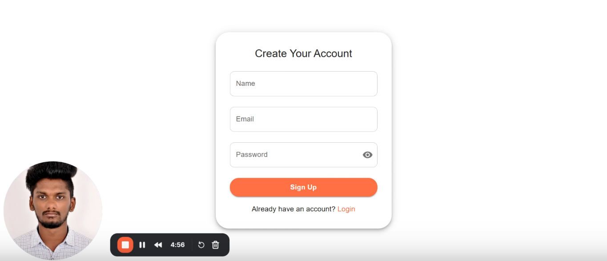

# 🏥 Patient Health Record Dashboard

A full-stack web app for clinics to manage patient records easily.

---

## ✅ Features

- User registration and login (JWT)
- Add, edit, delete patient records
- Fields: Name, Age, Gender, Diagnosis, Notes
- View all records in a dashboard
- Search and filter records
- Simple form validation
- Responsive design with Material UI

---

## 🎥 Demo

[](https://www.loom.com/share/6b85e96858ba4c74b87213dd5e05b922?sid=e80e5425-6b75-4ad1-9714-7d1b09b7ed28)

---

## 🛠 Technologies

- **Frontend**: React, Material UI, Axios
- **Backend**: Node.js, Express, Mongoose, JWT, bcrypt
- **Database**: MongoDB Atlas

---

## 📁 Folder Structure

```bash
patient-health-record/
├── client/   # React frontend
└── server/   # Node.js backend
```

---

## 🚀 How to Run the Project

### 1. Prerequisites

- **Node.js** (v14 or above)
- **npm** (comes with Node.js)
- **MongoDB** (MongoDB Atlas)

### 2. Setup Steps

1. **Clone the repo**

   ```bash
   git clone https://github.com/ajeeth-g/patient-health-record.git
   ```

2. **Install backend dependencies**

   ```bash
   cd server
   npm install
   ```

3. **Install frontend dependencies**

   ```bash
   cd ../client
   npm install
   ```

4. **Create `.env` file in `server/`**

   ```env
   PORT=5000
   MONGO_URI=your_mongodb_uri
   JWT_SECRET=your_secret_key
   ```

5. **Start backend**

   ```bash
   cd server
   npx nodemon server.js
   ```

6. **Start frontend**

   ```bash
   cd client
   npm run dev
   ```
